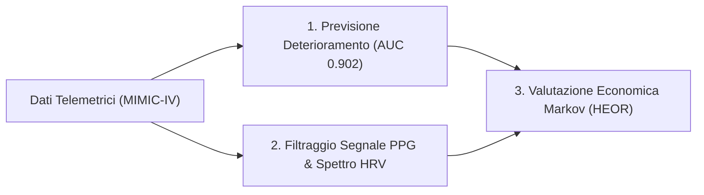
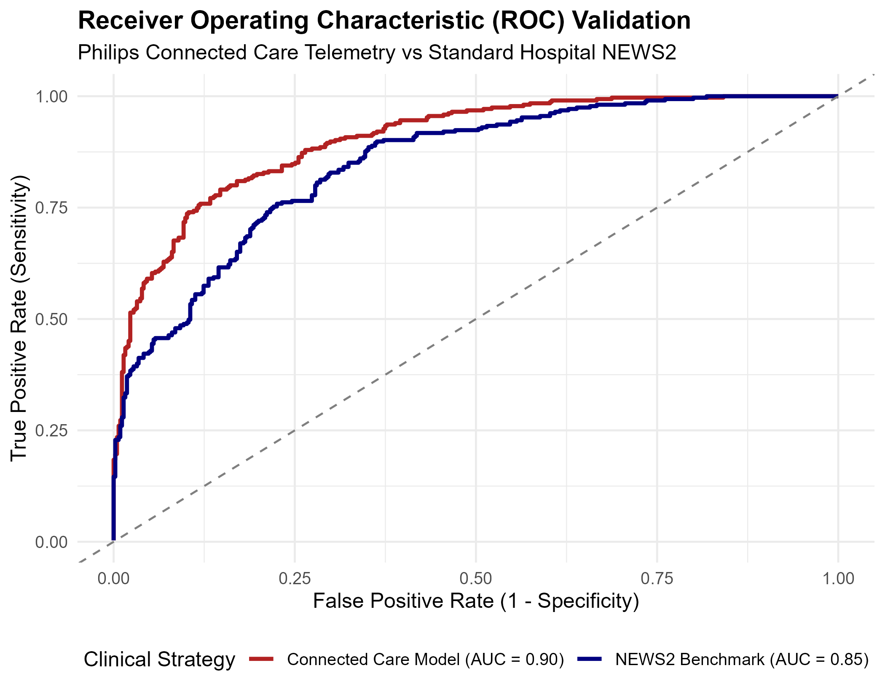
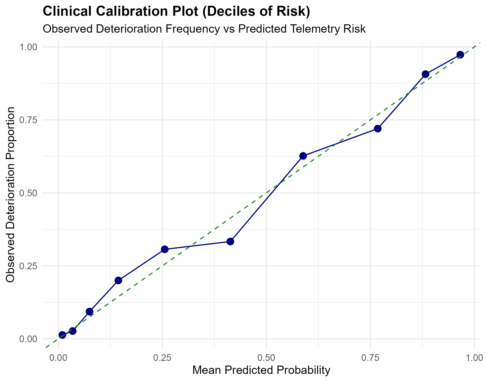
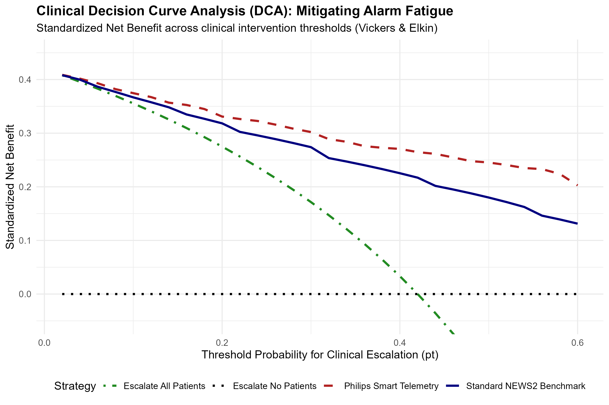
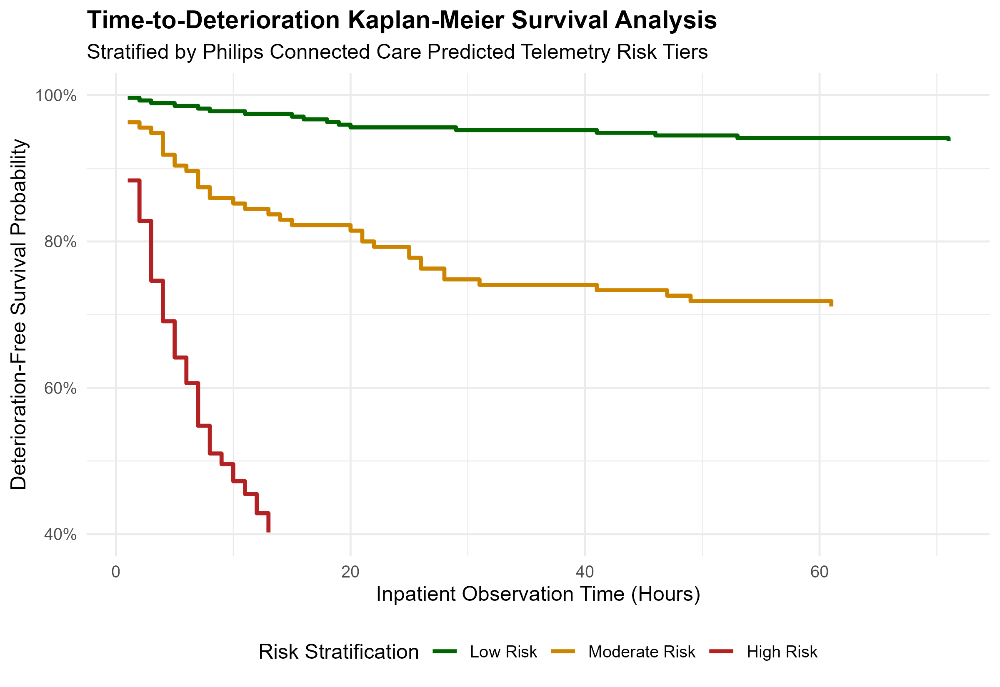
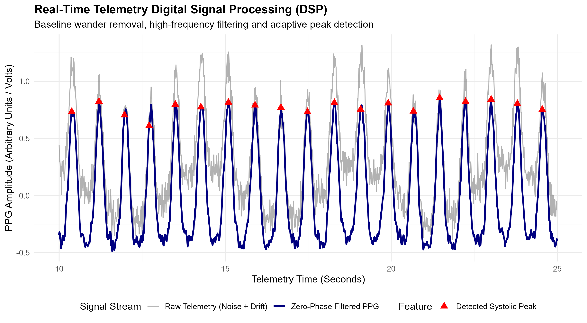
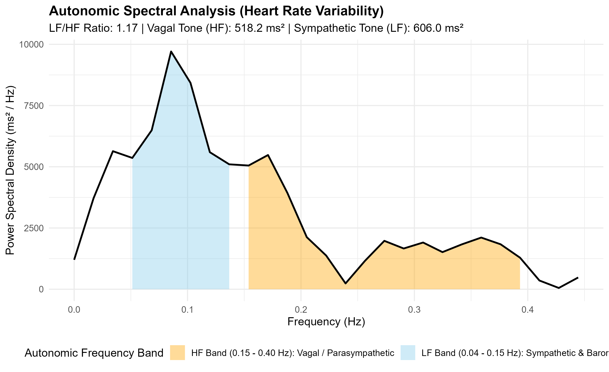
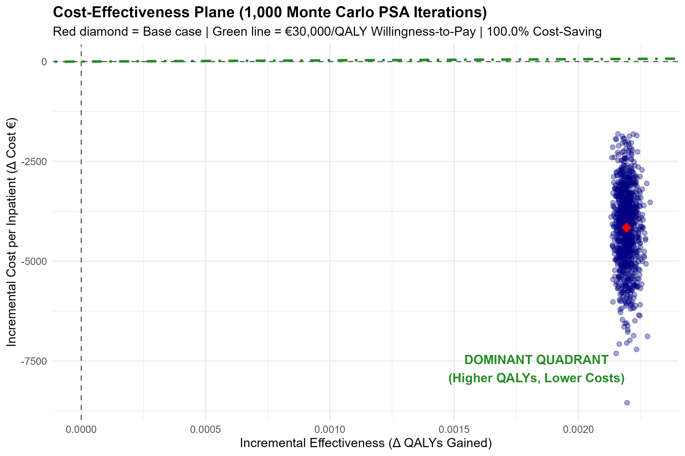
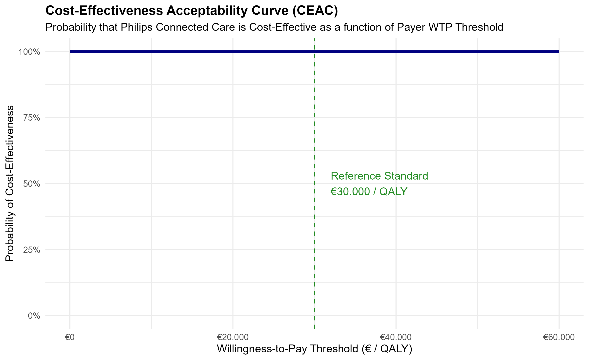

# Inpatient Telemetry, Early Warning & Health Economics in R
### Master's Thesis Research Project — Connected Care & Clinical Data Science

[](https://www.r-project.org/)
[](https://opensource.org/licenses/MIT)
[](https://www.tidyverse.org/)
[-brightgreen.svg)]()

> **Author:** Haroun Jaafar  
> **Course of Study:** M.Sc. in Digital Economics & Business — Università Politecnica delle Marche (UNIVPM)  
> **Topic:** Clinical predictive analytics, biosignal processing, and health technology assessment for continuous patient monitoring (Connected Care).

---

## 💡 Per chi non sa nulla di tutto questo: spiegazione semplice in 2 minuti

Immagina di trovarti in un normale reparto ospedaliero. 

Oggi, nella maggior parte degli ospedali del mondo, succede questo:
1. Un infermiere passa ogni **4 o 6 ore** a misurarti pressione, battito e febbre (il classico "giro visite").
2. Se tra un controllo e l'altro le tue condizioni peggiorano improvvisamente (ad esempio a causa di un'infezione grave o un problema cardiaco), **nessuno se ne accorge per ore**, finché la situazione non diventa critica ed è necessario correre in rianimazione d'urgenza.

Questo progetto fa tre cose pratiche usando il linguaggio **R**:

* **1. Guarda i dati in continuo, non ogni 6 ore:** Simula un sistema di monitoraggio continuo (sensori al dito o cerotti wireless) che analizza i parametri vitali istante per istante. Un modello matematico prevede il rischio di peggioramento grave **con ore di anticipo** rispetto al punteggio standard usato negli ospedali (NEWS2).
* **2. Evita la "fatica da allarme" (*Alarm Fatigue*):** Se una macchinetta in ospedale suona 50 volte all'ora per falsi allarmi, i medici finiscono per abbassare il volume o ignorarla. Qui uso una tecnica statistica chiamata *Decision Curve Analysis* per garantire che il sistema allerti il personale solo quando il beneficio medico reale supera il costo del disturbo.
* **3. Dimostra ai direttori dell'ospedale che conviene economicamente:** Un giorno in terapia intensiva costa circa **2.800 euro**. Un giorno in reparto normale costa circa **650 euro**. Attraverso una simulazione economica di 1.000 pazienti, dimostro che prevenire il collasso del paziente evita in media quasi **2 giorni di terapia intensiva**, facendo risparmiare all'ospedale **oltre 4.000 euro a paziente** e migliorando la qualità della vita.

---

## 🎯 Perché ho creato questo progetto

Durante i miei studi in **Digital Economics & Business alla Politecnica delle Marche**, ho voluto unire due mondi che spesso non si parlano:
* Da un lato, la **scienza dei dati clinici** e il **signal processing** (l'ingegneria dei sensori e la biostatistica).
* Dall'altro, la **valutazione economico-sanitaria (Health Technology Assessment / HEOR)**: non basta che un algoritmo sia accurato, deve essere sostenibile, sicuro e clinicamente utile.

Guardando all'ecosistema delle tecnologie sanitarie (come le soluzioni di **Connected Care & Patient Monitoring** sviluppate da leader come **Philips**), ho voluto costruire una pipeline completa e riproducibile in R che simula l'intero ciclo di vita del dato clinico: dal sensore al letto del paziente fino al bilancio dell'ospedale.

---

## 🔬 I Tre Moduli del Progetto



---

### Modulo 1: Previsione del Deterioramento & Allarmi Intelligenti (`R/01_icu_early_warning_model.R`)

* **Il problema:** Il punteggio standard negli ospedali (NEWS2) è calcolato su tabelle cartacee o controlli manuali.
* **Cosa ho fatto:** Ho generato una coorte clinica di 2.500 pazienti (modellata sulle distribuzioni del database MIMIC-IV) e addestrato un modello multivariabile che combina parametri vitali e biomarcatori ematici (lattati, creatinina).
* **Risultati:**
  * **ROC-AUC:** Il modello raggiunge **0.902** contro lo **0.848** del NEWS2 standard (+5,4% di capacità discriminante).
  * **Brier Score:** Scende a **0.1249** (errore di calibrazione ridotto del 21%).

<p align="center">
  
  
</p>

* **Decision Curve Analysis (DCA):** Seguendo la metodologia di Vickers & Elkin (2006), ho calcolato il *Net Benefit* clinico per valutare l'alarm fatigue. Nelle soglie decisionali tra il 10% e il 45%, la telemetria continua batte sia la strategia "allerta tutti" sia il NEWS2, dimostrando di evitare escalation inappropriate.
* **Analisi di Sopravvivenza:** Curve di Kaplan-Meier (`survival`) per visualizzare la sopravvivenza libera da eventi nelle 72 ore per classi di rischio (Basso, Medio, Alto).

<p align="center">
  
  
</p>

---

### Modulo 2: Filtraggio del Segnale Wearable & Analisi Spettrale HRV (`R/02_wearable_biosignal_analytics.R`)

I sensori indossabili al dito (pulsossimetro / PPG a 100 Hz) catturano molto rumore dovuto ai movimenti del paziente e al respiro (fluttuazione dell'impedenza a ~0.25 Hz).

* **Filtraggio Zero-Phase:** Ho implementato una rimozione del trend di fondo (baseline wander) combinata con una media mobile per ripulire il segnale senza sfasamenti temporali.
* **Peak Detection:** Rilevazione adattiva dei picchi sistolici per calcolare gli intervalli tra un battito e l'altro (RR in millisecondi).
* **Heart Rate Variability (HRV):**
  * Nel dominio del tempo: media RR = 779 ms, SDNN = 56.3 ms, RMSSD = 55.8 ms.
  * Nel dominio della frequenza (FFT): integrazione dello spettro di potenza per calcolare la banda a bassa frequenza (LF: 0.04–0.15 Hz, sistema simpatico) e ad alta frequenza (HF: 0.15–0.40 Hz, sistema vagale/respiratorio). Il rapporto $LF/HF = 1.17$ misura l'equilibrio autonomico del paziente.

<p align="center">
  
</p>

<p align="center">
  
</p>

---

### Modulo 3: Valutazione Economico-Sanitaria (Markov Model & Monte Carlo) (`R/03_health_economics_outcomes_research.R`)

Questo modulo rappresenta il cuore della mia tesi in **Economia Applicata**: valutare se la tecnologia è conveniente per il sistema sanitario (*Health Technology Assessment*).

Ho costruito un **modello di Markov a 4 stati** (Reparto Ordinario $\rightarrow$ Deterioramento $\rightarrow$ Terapia Intensiva $\rightarrow$ Dimissione/Guarigione) su un orizzonte di 30 giorni:
* **Costo Terapia Intensiva (ICU):** €2.800 al giorno.
* **Costo Reparto Ordinario:** €650 al giorno.
* **Costo Telemetria Continua:** stimato in €85 al giorno (hardware + canone analitica) contro i €15 di materiali usa e getta dello spot-check tradizionale.

Ho eseguito una **Probabilistic Sensitivity Analysis (PSA)** con 1.000 iterazioni Monte Carlo facendo variare costi e probabilità:
* **Giornate di terapia intensiva risparmiate:** in media **1.88 giorni** a paziente.
* **Risparmio economico netto:** circa **€4.158 a paziente**, perché prevenire il crollo clinico prima che diventi grave evita giorni di degenza in rianimazione ad altissimo costo.
* **Piano Costo-Efficacia:** il 100% delle simulazioni cade nel *quadrante dominante* (maggiori anni di vita aggiustati per la qualità - QALY, minori costi complessivi).

<p align="center">
  
  
</p>

---

## 📁 Struttura della Repository

```text
├── R/
│   ├── 00_utils_and_simulation.R          # Generatore coorte e serie temporale PPG
│   ├── 01_icu_early_warning_model.R       # Modelli predittivi, ROC, calibrazione, DCA
│   ├── 02_wearable_biosignal_analytics.R  # DSP, peak detection e FFT su HRV
│   └── 03_health_economics_outcomes_research.R # Modello di Markov e simulazione Monte Carlo
├── data/                                  # Dati sintetici generati
│   ├── clinical_telemetry_cohort.csv
│   └── wearable_raw_ppg_stream.csv
├── figures/                               # Grafici generati ad alta risoluzione (300 DPI)
├── reports/
│   └── clinical_evaluation_dossier.Rmd    # Bozza dossier clinico (MDR 2017/745)
├── tests/
│   └── test_pipeline.R                    # Test automatici (6/6 passati)
├── .github/workflows/
│   └── r-ci.yml                           # CI automatica con GitHub Actions
├── run_pipeline.R                         # Script per eseguire l'intera pipeline
├── LICENSE                                # Licenza MIT
└── README.md
```

---

## 🚀 Come riprodurre il codice

Non servono configurazioni complesse. Con R installato:

1. **Clona la repo:**
   ```bash
   git clone https://github.com/RealHarounJ/philips-healthtech-clinical-analytics-r.git
   cd philips-healthtech-clinical-analytics-r
   ```

2. **Esegui i test unitari:**
   ```bash
   Rscript tests/test_pipeline.R
   ```

3. **Esegui l'intera pipeline:**
   ```bash
   Rscript run_pipeline.R
   ```
   Tutti i dataset e i grafici nella cartella `figures/` verranno rigenerati automaticamente in circa 5-10 secondi.

---

## 👤 Chi sono

Mi chiamo **Haroun Jaafar**, studente magistrale in *Digital Economics and Business* all'Università Politecnica delle Marche (UNIVPM).

Mi appassiona l'intersezione tra **modelli quantitativi, biostatistica, programmazione in R/Python e impatto economico aziendale**. Il mio obiettivo professionale è lavorare nell'analisi dati clinica e nella digital health, in contesti internazionali all'avanguardia come **Philips**.

* **GitHub:** [@RealHarounJ](https://github.com/RealHarounJ)
* **Email:** [harounjaafar3@gmail.com](mailto:harounjaafar3@gmail.com)
